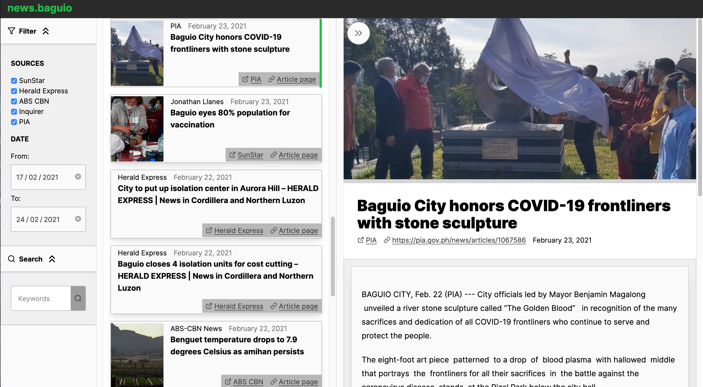

# News In Baguio City

## What is this? 
I kept myself updated by reading [/r/philippines](www.reddit.com/r/philippines). But that sub quickly became depressing.

I built this site to keep away from `/r/philippines`'s depressing news.

To keep costs low, I'm currently hosting it on a free vercel instance here. [News In Baguio City site](https://news-sa-baguio.vercel.app/)

## How does it work?

Every few hours it scrapes the latest articles from different news websites and stores it into [Supabase](https://app.supabase.io/)

The client shows the list for the scraped articles and displays the contents.

## Contributing

Feel free to open up a PR and ping me on it.